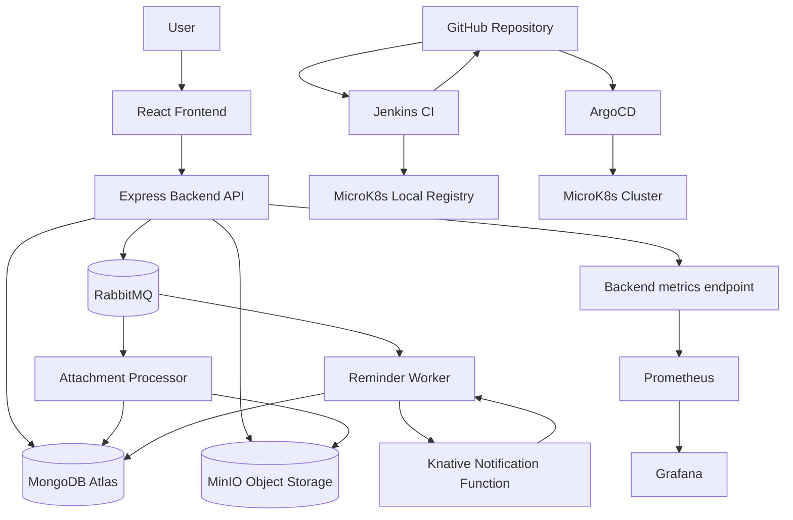

# Cloud Native To-Do Application

This project implements a cloud-native To-Do / Notes / Reminder application using Kubernetes, serverless functions, asynchronous messaging, object storage, monitoring, automation, and GitOps CI/CD.

The application was developed as part of the **Cloud Native Applications** semester project.

---

## 1. Project Overview

The original application was extended into a cloud-native system with multiple independent components:

- React frontend
- Express.js backend API
- MongoDB Atlas database
- RabbitMQ message broker
- MinIO object storage
- Background workers
- Knative serverless notification function
- Prometheus monitoring
- Grafana dashboards
- Jenkins CI pipeline
- ArgoCD GitOps deployment
- Ansible automation

The system runs locally on a MicroK8s Kubernetes cluster.

---

## 2. Architecture



---

## Container Images

The Jenkins pipeline builds and publishes all application images to two registries:

| Registry | Purpose |
|---|---|
| MicroK8s local registry `localhost:32000` | Used by the local MicroK8s deployment |
| GitHub Container Registry `ghcr.io/paulkons` | Used for external image publication under the project owner's GitHub account |

Published images:

```text
ghcr.io/paulkons/todo-backend
ghcr.io/paulkons/todo-frontend
ghcr.io/paulkons/todo-reminder-worker
ghcr.io/paulkons/todo-attachment-processor
ghcr.io/paulkons/todo-notification-function
