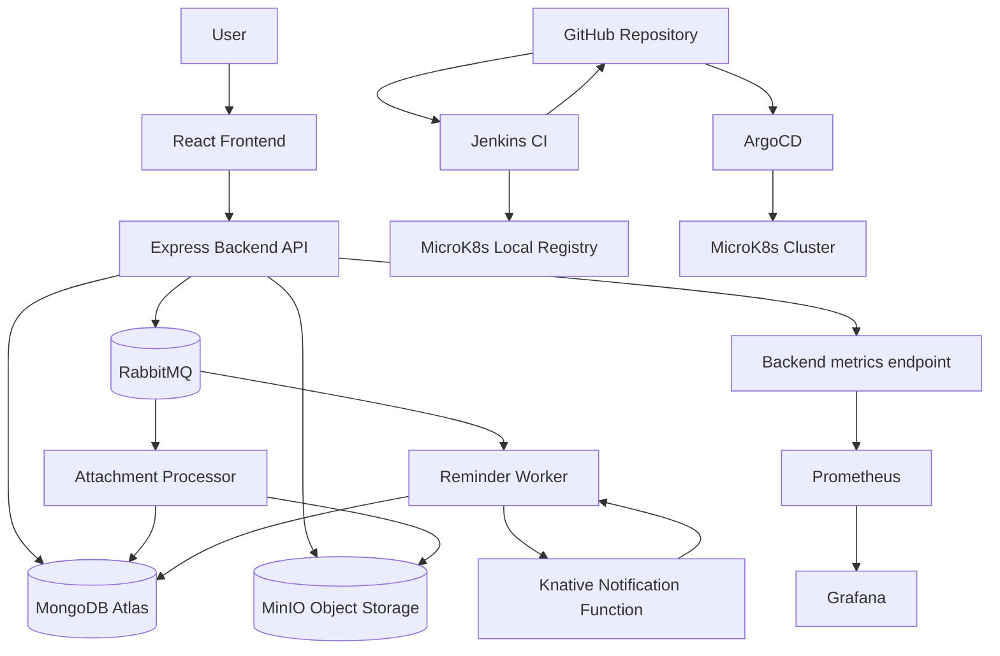

# Cloud Native To-Do Application

This project implements a cloud-native To-Do / Notes / Reminder application using Kubernetes, serverless functions, asynchronous messaging, object storage, monitoring, automation, and GitOps CI/CD.

The application was developed as part of the **Cloud Native Applications** semester project.

---

## 1. Project Overview

The original application was extended into a cloud-native system with multiple independent components:

- React frontend
- Express.js backend API
- MongoDB Atlas database
- RabbitMQ message broker
- MinIO object storage
- Background workers
- Knative serverless notification function
- Prometheus monitoring
- Grafana dashboards
- Jenkins CI pipeline
- ArgoCD GitOps deployment
- Ansible automation

The system runs locally on a MicroK8s Kubernetes cluster.

---

## 2. Architecture



---

## Container Images

The Jenkins pipeline builds and publishes all application images to two registries:

| Registry | Purpose |
|---|---|
| MicroK8s local registry `localhost:32000` | Used by the local MicroK8s deployment |
| GitHub Container Registry `ghcr.io/paulkons` | Used for external image publication under the project owner's GitHub account |

Published images:

```text
ghcr.io/paulkons/todo-backend
ghcr.io/paulkons/todo-frontend
ghcr.io/paulkons/todo-reminder-worker
ghcr.io/paulkons/todo-attachment-processor
ghcr.io/paulkons/todo-notification-function

---

## 3. Main Technologies

| Area | Technology |
|---|---|
| Frontend | React / Vite |
| Backend | Node.js / Express |
| Database | MongoDB Atlas |
| Message broker | RabbitMQ |
| Object storage | MinIO |
| Serverless | Knative Serving |
| Kubernetes | MicroK8s |
| CI | Jenkins |
| CD / GitOps | ArgoCD |
| Automation | Ansible |
| Monitoring | Prometheus |
| Visualization | Grafana |
| Container registry | MicroK8s local registry and GitHub Container Registry |

---

## 4. Application Components

### Frontend

The frontend provides the user interface for authentication, task creation, notes, file uploads, reminders and notifications.

Local URL:

```text
http://localhost:30517
```

### Backend API

The backend exposes REST API endpoints for authentication, tasks, notes, attachments, reminders and Prometheus metrics.

Health endpoint:

```text
http://localhost:30500/health
```

Metrics endpoint:

```text
http://localhost:30500/metrics
```

### MongoDB Atlas

MongoDB Atlas stores application data such as users, tasks, notes, attachment metadata, reminder state and generated notifications.

Large uploaded files are not stored directly in MongoDB. The actual files are stored in MinIO, while MongoDB stores metadata and object references.

### RabbitMQ

RabbitMQ is used for asynchronous processing.

Main queues:

```text
reminder.jobs
attachment.uploaded
```

RabbitMQ management UI:

```text
http://localhost:30672
```

### MinIO

MinIO is used as S3-compatible object storage for uploaded note attachments.

MinIO console:

```text
http://localhost:30901
```

Bucket:

```text
note-attachments
```

### Workers

The project includes two main background workers:

| Worker | Purpose |
|---|---|
| reminder-worker | Processes due reminders and calls the Knative notification function |
| attachment-processor | Processes uploaded attachment events and marks attachments as processed |

### Knative Notification Function

The notification function is deployed as a Knative Service and represents the serverless part of the project.

It exposes:

```text
GET /health
POST /notify
```

Check the Knative service:

```bash
microk8s kubectl get ksvc -n todo-app
```

---

## 5. Implemented Cloud-Native Patterns

### Retry Pattern

The reminder worker uses retry logic when calling the Knative notification function. This protects the reminder flow from temporary failures such as service startup delay, temporary routing issues, or transient network errors.

### Claim Check Pattern

The attachment flow uses the Claim Check pattern.

```text
Actual file content -> MinIO
File metadata/objectKey -> MongoDB
```

This keeps MongoDB focused on structured metadata while MinIO handles binary file storage.

### Idempotency

The attachment processor checks whether an attachment has already been processed before processing it again. If the same message is consumed more than once, the processor does not duplicate work or corrupt application state.

### Asynchronous Processing

The backend publishes messages to RabbitMQ instead of processing all background work synchronously during the user request. Workers consume messages independently.

### Stateless Services

The backend, workers and notification function are stateless. Persistent state is externalized to MongoDB Atlas, RabbitMQ, MinIO, ConfigMaps and Secrets.

---

## 6. Deployment and Execution Guide

This section explains how to deploy, verify and run the application in the local MicroK8s environment.

The application is designed to run on a local Ubuntu VM with MicroK8s. The deployment files are stored in GitHub and synchronized to the cluster through ArgoCD.

---

### 6.1 Prerequisites

The VM should have the following tools and services available:

```text
Docker
Docker Compose
MicroK8s
Ansible
Jenkins
ArgoCD
Knative Serving
Kourier
```

The required MicroK8s addons are:

```bash
microk8s enable dns storage registry ingress
```

The local MicroK8s registry is expected at:

```text
localhost:32000
```

---

### 6.2 Repository Setup

Clone the repository:

```bash
git clone https://github.com/PaulKons/todo-cloud-native.git
cd todo-cloud-native
```

The repository contains the source code, Dockerfiles, Kubernetes manifests, Jenkinsfile, Ansible playbook, ArgoCD configuration, Docker Compose file, monitoring files and SLA test evidence.

---

### 6.3 Credentials and Sensitive Values

Some credentials are intentionally not uploaded to GitHub. They are shared separately with the project deliverables.

Sensitive values include:

```text
MongoDB Atlas connection string
JWT secret
RabbitMQ credentials
MinIO credentials
Jenkins credentials/tokens
ArgoCD credentials
Grafana credentials
Application test account credentials
GitHub token for Jenkins/GHCR
```

The repository should not contain real secrets, tokens, passwords, kubeconfig files or private environment files.

Configuration is handled through:

```text
Kubernetes ConfigMaps for non-sensitive values
Kubernetes Secrets for sensitive values
Ansible for creating/updating deployment configuration
```

Before committing changes, check:

```bash
git status
```

Do not commit `.env`, token files, real credentials or local cookie files.

---

### 6.4 Deploying with Ansible

Ansible is used as the bootstrap and recovery automation layer.

Run from the repository root:

```bash
ansible-playbook -i ansible/inventory.ini ansible/deploy-todo-app.yml
```

The playbook applies or verifies:

```text
namespace
ConfigMap
Secret
Kubernetes manifests
rollout status
pod status
```

Ansible is executed manually. It does not continuously refresh the environment. Continuous synchronization is handled by ArgoCD.

---

### 6.5 Deploying with Kustomize

The Kubernetes manifests are stored under:

```text
k8s/base
```

Manual deployment command:

```bash
microk8s kubectl apply -k k8s/base
```

Check the result:

```bash
microk8s kubectl get pods -n todo-app
microk8s kubectl get svc -n todo-app
```

Normally this manual command is not needed after ArgoCD is configured, because ArgoCD synchronizes the cluster from GitHub.

---

### 6.6 ArgoCD GitOps Synchronization

ArgoCD watches the GitHub repository and specifically the path:

```text
k8s/base
```

Check the ArgoCD application:

```bash
microk8s kubectl get application -n argocd
```

Open ArgoCD:

```text
https://localhost:30443
```

Expected application state:

```text
Synced
Healthy
```

ArgoCD compares the desired state in GitHub with the actual state in MicroK8s and synchronizes the cluster.

---

### 6.7 Jenkins CI/CD Flow

Jenkins builds and publishes the application images.

Jenkins performs:

```text
checkout source code
install/check dependencies
build Docker images
push images to MicroK8s local registry
push images to GitHub Container Registry
update Kubernetes image tags
commit updated manifests back to GitHub
```

Jenkins UI:

```text
http://localhost:8080
```

After Jenkins updates the manifests and pushes them to GitHub, ArgoCD detects the change and redeploys the updated version to MicroK8s.

---

## 7. Running and Verifying the Pods

### 7.1 Check Application Pods

```bash
microk8s kubectl get pods -n todo-app
```

Expected components include:

```text
frontend
backend
rabbitmq
minio
attachment-processor
reminder-worker
notification-function
prometheus
grafana
```

### 7.2 Check Deployments

```bash
microk8s kubectl get deployments -n todo-app
```

### 7.3 Check Services

```bash
microk8s kubectl get svc -n todo-app
```

### 7.4 Check Knative Services

```bash
microk8s kubectl get ksvc -n todo-app
```

### 7.5 Check Persistent Volumes

```bash
microk8s kubectl get pvc -n todo-app
```

Grafana and MinIO should use persistent storage. PVCs should normally be in `Bound` status.

---

## 8. Main Local URLs

| Service | URL |
|---|---|
| Frontend | http://localhost:30517 |
| Backend health | http://localhost:30500/health |
| Backend metrics | http://localhost:30500/metrics |
| RabbitMQ UI | http://localhost:30672 |
| MinIO UI | http://localhost:30901 |
| Prometheus | http://localhost:30090 |
| Grafana | http://localhost:30300 |
| ArgoCD | https://localhost:30443 |
| Jenkins | http://localhost:8080 |

The backend container listens internally on port `5000`, but Kubernetes exposes it externally through NodePort `30500`.

Use:

```text
http://localhost:30500/health
```

Do not use this for the Kubernetes deployment:

```text
http://localhost:5000/health
```

unless the backend is running directly on the host or through Docker Compose.

---

## 9. Health Checks and Logs

### 9.1 Backend Health

```bash
curl http://localhost:30500/health
```

Expected response:

```json
{"status":"ok"}
```

### 9.2 Backend Metrics

```bash
curl http://localhost:30500/metrics
```

### 9.3 Logs

Backend:

```bash
microk8s kubectl logs -n todo-app deployment/backend --tail=100
```

Attachment processor:

```bash
microk8s kubectl logs -n todo-app deployment/attachment-processor --tail=100
```

Reminder worker:

```bash
microk8s kubectl logs -n todo-app deployment/reminder-worker --tail=100
```

RabbitMQ:

```bash
microk8s kubectl logs -n todo-app deployment/rabbitmq --tail=100
```

MinIO:

```bash
microk8s kubectl logs -n todo-app deployment/minio --tail=100
```

Knative notification function:

```bash
microk8s kubectl logs -n todo-app -l serving.knative.dev/service=notification-function --tail=100
```

Follow logs live:

```bash
microk8s kubectl logs -n todo-app deployment/backend -f
```

---

## 10. Restarting and Scaling Workloads

### 10.1 Restart Deployments

Backend:

```bash
microk8s kubectl rollout restart deployment/backend -n todo-app
```

Attachment processor:

```bash
microk8s kubectl rollout restart deployment/attachment-processor -n todo-app
```

Reminder worker:

```bash
microk8s kubectl rollout restart deployment/reminder-worker -n todo-app
```

Grafana:

```bash
microk8s kubectl rollout restart deployment/grafana -n todo-app
```

Check rollout status:

```bash
microk8s kubectl rollout status deployment/backend -n todo-app
```

### 10.2 Scale Backend

The backend is stateless and can run with multiple replicas.

Check current replicas:

```bash
microk8s kubectl get deployment backend -n todo-app
```

Temporary scaling example:

```bash
microk8s kubectl scale deployment backend -n todo-app --replicas=3
```

If ArgoCD manages the manifest, manual scaling may be reverted if the Git manifest defines a different replica count.

For a permanent change, update:

```text
k8s/base/backend/backend.yaml
```

then commit and push the change. ArgoCD will synchronize the cluster.

---

## 11. Demonstrating Kubernetes Self-Healing

Delete one backend pod:

```bash
microk8s kubectl get pods -n todo-app | grep backend
```

Then:

```bash
microk8s kubectl delete pod <backend-pod-name> -n todo-app
```

Watch Kubernetes create a replacement pod:

```bash
microk8s kubectl get pods -n todo-app -w
```

This demonstrates that the backend pods are replaceable and that persistent state is externalized to MongoDB Atlas, RabbitMQ and MinIO.

---

## 12. Verifying Knative

Check Knative namespaces:

```bash
microk8s kubectl get ns | grep knative
```

Check Knative Serving pods:

```bash
microk8s kubectl get pods -n knative-serving
```

Check Knative CRDs:

```bash
microk8s kubectl get crd | grep serving.knative.dev
```

Check the notification function Knative Service:

```bash
microk8s kubectl get ksvc -n todo-app
```

Describe the Knative Service:

```bash
microk8s kubectl describe ksvc notification-function -n todo-app
```

Check Knative-generated resources:

```bash
microk8s kubectl get configurations,routes,revisions -n todo-app
```

Check notification function logs:

```bash
microk8s kubectl logs -n todo-app -l serving.knative.dev/service=notification-function --tail=50
```

This proves both that Knative is installed and that the notification function is deployed as a Knative-managed service.

---

## 13. Verifying RabbitMQ and Async Processing

Open RabbitMQ:

```text
http://localhost:30672
```

Check queues:

```text
attachment.uploaded
reminder.jobs
```

The attachment flow uses RabbitMQ for asynchronous processing. When a file is uploaded, the backend publishes an event and the attachment processor consumes it.

Check attachment processor logs:

```bash
microk8s kubectl logs -n todo-app deployment/attachment-processor --tail=100
```

---

## 14. Verifying Claim Check with MinIO

Open MinIO:

```text
http://localhost:30901
```

Check the bucket:

```text
note-attachments
```

Uploaded files should appear in this bucket.

The Claim Check pattern is implemented as:

```text
actual file content -> MinIO
file metadata/objectKey -> MongoDB
```

---

## 15. Monitoring and Metrics

Prometheus:

```text
http://localhost:30090
```

Grafana:

```text
http://localhost:30300
```

Useful Prometheus queries:

```promql
todo_http_requests_total
```

```promql
sum(rate(todo_http_requests_total[1m]))
```

```promql
histogram_quantile(0.95, sum(rate(todo_http_request_duration_seconds_bucket[5m])) by (le))
```

```promql
todo_tasks_created_total
```

```promql
todo_attachments_uploaded_total
```

---

## 16. SLA Test Evidence

SLA/load-testing files are stored under:

```text
sla-tests/
```

Important files:

```text
sla-tests/health-test.js
sla-tests/SLA_RESULTS.md
sla-tests/results/high-cdf.png
```

The SLA tests were executed using k6 and measured backend availability and response time under controlled load.

The saved SLA results document includes test scenarios, measured results, threshold evaluation and CDF graph.

---

## 17. Recovery After VM Restart

After restarting the VM, check MicroK8s:

```bash
microk8s status --wait-ready
```

Check all pods:

```bash
microk8s kubectl get pods -A
```

Check application pods:

```bash
microk8s kubectl get pods -n todo-app
```

Check Jenkins:

```bash
docker ps | grep jenkins
```

If MicroK8s is not ready, restart it:

```bash
sudo microk8s stop
sudo microk8s start
microk8s status --wait-ready
```

If application pods need to be restarted:

```bash
microk8s kubectl rollout restart deployment/backend -n todo-app
microk8s kubectl rollout restart deployment/attachment-processor -n todo-app
microk8s kubectl rollout restart deployment/reminder-worker -n todo-app
```

If configuration or secrets need to be reapplied:

```bash
ansible-playbook -i ansible/inventory.ini ansible/deploy-todo-app.yml
```

---

## 18. Docker Compose

The repository also includes a general Docker Compose file for local multi-container development.

Docker Compose is useful for local development and quick testing. The final cloud-native deployment target is MicroK8s.

```bash
docker compose up -d
```

---

## 19. Repository Structure

```text
.
├── backend
├── frontend
├── reminder-worker
├── attachment-processor
├── notification-function
├── k8s
│   └── base
├── ansible
├── argocd
├── sla-tests
├── docker-compose.yml
├── Jenkinsfile
└── README.md
```

---

## 20. Demo Scenario

Suggested live demo flow:

1. Show the architecture diagram.
2. Show running pods in K9s or with `kubectl`.
3. Open the frontend.
4. Create a task or note.
5. Upload an attachment.
6. Show the uploaded file in MinIO.
7. Show RabbitMQ queues.
8. Show attachment processor logs.
9. Trigger or show reminder processing.
10. Show Knative service and notification function logs.
11. Show Prometheus metrics.
12. Show Grafana dashboard.
13. Show SLA results and CDF graph.
14. Make a small code/log change.
15. Push to GitHub.
16. Show Jenkins pipeline.
17. Show ArgoCD synchronization.
18. Show the updated pod/image running in MicroK8s.
19. Run the Ansible playbook to demonstrate bootstrap/recovery automation.
20. Delete one backend pod and show Kubernetes recreating it.

---

## 21. Notes for Evaluators

The GitHub repository does not include real secrets or private credentials.

Required credentials and test accounts are provided separately with the project deliverables.

This includes credentials for:

```text
application test account
RabbitMQ UI
MinIO UI
Grafana
ArgoCD
Jenkins
MongoDB Atlas connection
GitHub token usage where applicable
```

The project can be evaluated through the local VM environment, the GitHub repository, the README, the report, the SLA results and the live demo.

---

## 22. Current Status

Implemented:

- cloud-native application deployment
- Kubernetes orchestration with MicroK8s
- async messaging with RabbitMQ
- object storage with MinIO
- serverless notification function with Knative
- monitoring with Prometheus
- visualization with Grafana
- CI with Jenkins
- GitOps CD with ArgoCD
- automation with Ansible
- external image publication through GitHub Container Registry
- SLA/load testing with k6
- multiple cloud-native design patterns

---

## 23. Author

Pavlos Konstantinidis  
Cloud Native Applications Semester Project
