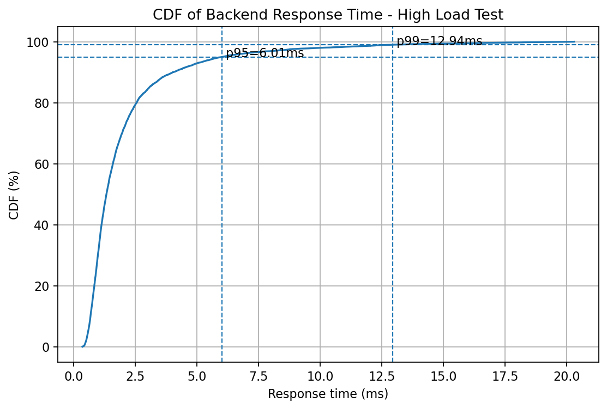

# SLA and Load Testing Results

## 1. Objective

The objective of this experiment was to evaluate the responsiveness and availability of the backend API running on the local MicroK8s Kubernetes cluster.

The tested endpoint was:

```text
http://localhost:30500/health
```

This endpoint was selected as a stable backend availability indicator because it verifies that the backend service is reachable and responding successfully through the Kubernetes NodePort.

---

## 2. Testing Tool

The load tests were executed using **k6** through Docker.

The test script is located at:

```text
sla-tests/health-test.js
```

The generated result files are stored under:

```text
sla-tests/results/
```

---

## 3. SLA Classes

The following SLA classes were defined for the backend service.

| SLA Class | Success Rate | Failed Requests | p95 Response Time | Interpretation |
|---|---:|---:|---:|---|
| Gold | >= 99% | < 1% | < 300 ms | High-quality service |
| Silver | >= 98% | < 2% | < 600 ms | Acceptable service |
| Bronze | >= 95% | < 5% | < 1000 ms | Minimum acceptable service |

The k6 test thresholds were configured as:

| Threshold | Target |
|---|---:|
| Failed HTTP requests | < 5% |
| p95 response time | < 1000 ms |

---

## 4. Test Scenarios

Three different load scenarios were executed.

| Scenario | Virtual Users | Duration | Endpoint |
|---|---:|---:|---|
| Light Load | 5 | 1 minute | `/health` |
| Medium Load | 20 | 2 minutes | `/health` |
| High Load | 50 | 2 minutes | `/health` |

---

## 5. Results Summary

| Scenario | Requests | Throughput | Failed Requests | Checks Succeeded | Average Latency | p90 Latency | p95 Latency | Max Latency | SLA Result |
|---|---:|---:|---:|---:|---:|---:|---:|---:|---|
| Light Load | 300 | 4.98 req/s | 0.00% | 100.00% | 1.74 ms | 3.00 ms | 3.54 ms | 16.80 ms | Gold |
| Medium Load | 2400 | 19.93 req/s | 0.00% | 100.00% | 1.83 ms | 2.93 ms | 4.01 ms | 62.36 ms | Gold |
| High Load | 6000 | 49.85 req/s | 0.00% | 100.00% | 1.77 ms | 3.09 ms | 4.36 ms | 31.20 ms | Gold |

---

## 6. Detailed Results

### 6.1 Light Load

| Metric | Value |
|---|---:|
| Virtual users | 5 |
| Duration | 1 minute |
| Total HTTP requests | 300 |
| Throughput | 4.98 req/s |
| Failed requests | 0.00% |
| Checks succeeded | 100.00% |
| Average response time | 1.74 ms |
| Minimum response time | 0.51 ms |
| Median response time | 1.31 ms |
| p90 response time | 3.00 ms |
| p95 response time | 3.54 ms |
| Maximum response time | 16.80 ms |
| SLA class | Gold |

---

### 6.2 Medium Load

| Metric | Value |
|---|---:|
| Virtual users | 20 |
| Duration | 2 minutes |
| Total HTTP requests | 2400 |
| Throughput | 19.93 req/s |
| Failed requests | 0.00% |
| Checks succeeded | 100.00% |
| Average response time | 1.83 ms |
| Minimum response time | 0.35 ms |
| Median response time | 1.29 ms |
| p90 response time | 2.93 ms |
| p95 response time | 4.01 ms |
| Maximum response time | 62.36 ms |
| SLA class | Gold |

---

### 6.3 High Load

| Metric | Value |
|---|---:|
| Virtual users | 50 |
| Duration | 2 minutes |
| Total HTTP requests | 6000 |
| Throughput | 49.85 req/s |
| Failed requests | 0.00% |
| Checks succeeded | 100.00% |
| Average response time | 1.77 ms |
| Minimum response time | 0.34 ms |
| Median response time | 1.21 ms |
| p90 response time | 3.09 ms |
| p95 response time | 4.36 ms |
| Maximum response time | 31.20 ms |
| SLA class | Gold |

---

## 7. Threshold Evaluation

| Threshold | Target | Light Load | Medium Load | High Load | Result |
|---|---:|---:|---:|---:|---|
| Failed HTTP requests | < 5% | 0.00% | 0.00% | 0.00% | Passed |
| p95 response time | < 1000 ms | 3.54 ms | 4.01 ms | 4.36 ms | Passed |
| Checks succeeded | 100% expected | 100.00% | 100.00% | 100.00% | Passed |

All scenarios passed the configured k6 thresholds.

---

## 8. CDF Graph

A CDF graph was generated from the high-load test.

The graph is stored at:

```text
sla-tests/results/high-cdf.png
```

Markdown reference:



The CDF graph shows the distribution of backend response times under the highest tested load of 50 virtual users.

---

## 9. Interpretation

The backend service successfully met the defined **Gold SLA** class for the tested endpoint.

Across all three load scenarios:

- HTTP failed requests remained at 0.00%.
- k6 checks succeeded at 100.00%.
- p95 response time remained below 5 ms.
- Throughput increased according to the number of virtual users.
- The backend remained stable under the tested local load.

The strongest test was the high-load scenario. It used 50 virtual users for 2 minutes and produced 6000 successful HTTP requests. The measured throughput was approximately 49.85 requests per second, while the p95 response time was approximately 4.36 ms.

This is significantly below the Gold SLA threshold of 300 ms.

---

## 10. Limitation

This SLA experiment focuses on the backend `/health` endpoint exposed through the Kubernetes NodePort.

The results validate backend responsiveness and availability under controlled local load. They do not represent the full end-to-end latency of more complex user actions, such as:

- user authentication
- task creation
- note creation
- file upload
- attachment processing
- reminder generation
- Knative notification execution

Therefore, the measurements should be interpreted as backend service availability and responsiveness measurements, not as complete end-to-end application performance measurements.

---

## 11. Conclusion

Based on the measured results, the backend API satisfies the **Gold SLA class** for the tested endpoint in the local MicroK8s environment.

The SLA/load-testing experiment provides evidence that the deployed backend service remained available, responsive, and stable under light, medium, and high controlled local load scenarios.
